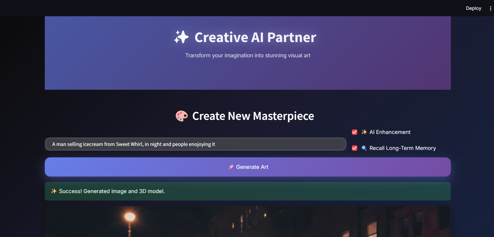
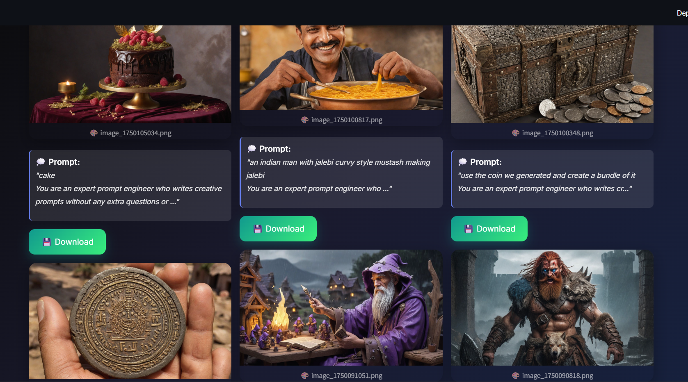

# Text-to-3D Model Generator

A sophisticated AI-powered application that converts text descriptions into 3D models through an intelligent pipeline featuring dual-memory systems and prompt enhancement capabilities.


# 🌐 Web App Showcase: 

## 🏠 Gnerate Page



---

## 🎨 Recent Generations 


---

## 🧠 Art Gallery 


---

## 🌟 Features

- **Interactive Frontend**: Streamlit-based interface with intuitive controls
- **Dual Memory System**: Short-term session memory and long-term vector database storage
- **Intelligent Prompt Enhancement**: AI-powered prompt optimization using Ollama
- **Brand Asset Continuity**: Maintains character, style, and brand consistency across generations
- **Complete Generation Pipeline**: Text → Enhanced Prompt → Image → 3D Model
- **Gallery System**: Creative artboard display and comprehensive generation history

## 🏗️ Architecture Overview

### Frontend (Streamlit)
- Text input for user prompts
- Two key checkboxes:
  - **Enhance Prompt**: Enable AI-powered prompt optimization
  - **Save to Long-term Memory**: Store generation context for future use
- **Recent Creations**: Creative artboard displaying recent generations
- **Complete Gallery**: Full history with prompts, generated content, and download options

### Backend Memory Systems

#### Long-term Memory
- **Vector Database**: FAISS CPU implementation
- **Embedding Model**: `all-MiniLM-L6-v2` for semantic similarity
- **Use Cases**: 
  - Character consistency across sessions
  - Brand asset definitions
  - Style palette maintenance
  - Subject detail retention

#### Short-term Memory
- **Session Variables**: Context passed within single session
- **Real-time Context**: Immediate conversation history

### AI Pipeline

1. **Context Retrieval**: Similarity search on long-term memory (if enabled)
2. **Prompt Enhancement**: Ollama with `gemma3:latest` model
3. **Image Generation**: OpenFabric SDK API
4. **3D Model Conversion**: OpenFabric SDK secondary API
5. **Storage & Display**: Save outputs and update gallery

## 🔧 Technical Implementation

### Modified Classes

#### InputClass
```python
class InputClass:
    prompt: str = None
    ai_enhanced: bool = False
    session_id: str = None
    recallLongTermMemory: bool = False
```

#### OutputClass
```python
class OutputClass:
    message: str = None
    image_path: str = None
    model_path: str = None
    session_id: str = None
```

### Key Components
- **Embedding Model**: `all-MiniLM-L6-v2` for vector similarity
- **LLM**: Ollama `gemma3:latest` for prompt enhancement
- **Vector DB**: FAISS CPU for long-term memory storage
- **APIs**: OpenFabric SDK for image and 3D model generation

## 🚀 Setup Instructions

### Prerequisites
- Docker installed
- Ollama installed and configured

### Step 1: Build Docker Image
```bash
docker build -t text-to-3d-generator .
```

### Step 2: Setup Ollama Model
```bash
# Pull the required model
ollama pull gemma3:latest

# Set environment variable for Docker communication
export OLLAMA_HOST=0.0.0.0:11434

# Serve the model
ollama serve
```
*Note: Ollama should be accessible at `http://host.docker.internal:11434`*

### Step 3: Run Docker Container
```bash
docker run -p 4999:8888 -v {BASE_PATH}/OpenFabric/app/output:/openfabric/app/outputs text-to-3d-generator
```
*Replace `{BASE_PATH}` with your actual base path*

### Step 4: Launch Application
```bash
streamlit run app.py
```

The application will be available at `http://localhost:4999`

## 💡 Usage Guide

1. **Enter Description**: Type your text description in the input field
2. **Configure Options**:
   - Check "Enhance Prompt" for AI optimization
   - Check "Save to Long-term Memory" to store context for future use
3. **Generate**: Click the generate button to start the pipeline
4. **View Results**: 
   - See immediate results in the recent creations artboard
   - Browse complete history in the gallery section
   - Download generated images and 3D models

## 🎯 Use Cases

### Character Consistency
Create multiple variations of the same character while maintaining visual consistency through long-term memory.

### Brand Asset Management
Define and maintain brand colors, styles, and visual elements across different generations.

### Creative Workflows
Build upon previous creations with contextual awareness and style continuity.

## 🔧 Configuration

### OpenFabric SDK
- Update APP_ID in the configuration for 3D model generation
- Ensure proper API credentials are configured

### Memory Settings
- Adjust FAISS index parameters for optimal similarity search
- Configure embedding model settings as needed

## 📁 Project Structure

```
├── app/
│   ├── utils/             # Core utility modules
│   │   ├── filehandle.py  # File handling operations
│   │   ├── llmCall.py     # LLM API calls and processing
│   │   ├── memory_manager.py # Memory management logic
│   │   └── vectordb.py    # Vector database operations
│   └── main.py            # Main application entry point
├── onto/                  # Ontology/schema definitions
├── frontend/              # Streamlit interface components
├── README.md              # Project documentation
├── swagger-ui.png         # API documentation screenshot
└── updated_readme.md      # Updated documentation
```

## 🤝 Contributing

This project implements a complete text-to-3D generation pipeline with intelligent memory management. The modular architecture allows for easy extension and customization of individual components.

## 📝 Notes

- The 3D model generation is fully implemented but requires proper OpenFabric APP_ID configuration
- Long-term memory provides powerful context retention for consistent character and brand asset generation
- The dual-memory system enables both immediate session context and persistent knowledge retention
